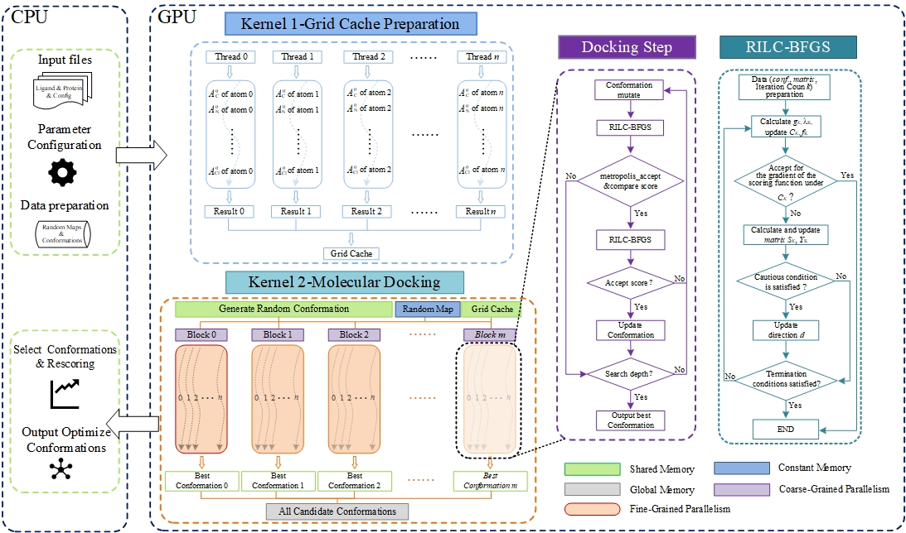

# Vina-CUDA
## Introduction
In this project, we propose **Vina-CUDA** based on [Vina-GPU 2.1](https://github.com/DeltaGroupNJUPT/Vina-GPU-2.1), which aims to further enhance Vina-GPU 2.1's docking speed by optimizing its core algorithms through deep utilization of GPU hardware features, thereby reducing the cost of virtual screening and increasing the efficiency of drug design. 

## The Acceleration and Accuracy of Vina-CUDA
* The runtime acceleration of Vina-CUDA comprae with the Vina-GPU 2.1, QuickVina 2-GPU 2.1 and QuickVina-W-GPU 2.1 in Autodock-GPU, CASF-2016, PPARG, Astex, and PoseBuster librarys.

* Accuracy comparison of Vina-CUDA on AutoDock-GPU and CASF-2016 library.

 ## Compiling and Running Methods
 ### Linux
 **Note**: At least 8M stack size is needed. To change the stack size, use `ulimit -s 8192`.
 1. install [boost library](https://www.boost.org/) (Current Version is 1.77.0)
 2. install [CUDA Toolkit](https://developer.nvidia.com/cuda-downloads) (Current Version: v12.2)   **Note**: CUDA library can be usually in `/usr/local/cuda` for NVIDIA GPU cards.
 3. Open the Makefile file and change the following information: 
       1. $WORK_DIR : Set as your working directory (eg: path/of/your/work/directory/Vina-CUDA);
       2. $BOOST_LIB_PATH : Set to the path where the BOOST library is located (eg: path/of/BOOST/boost_1_77_0);
       3. $NVCC_COMPILER : Set to the path of the NVCC compiler (eg: /usr/local/cuda-12.2/bin/nvcc).
 4. Save the Makefile and type `make clean` and `make source -jthread` to build `$(VINA_CUDA_METHODS)` that compile the kernel files on the fly (this would take some time at the first use).
