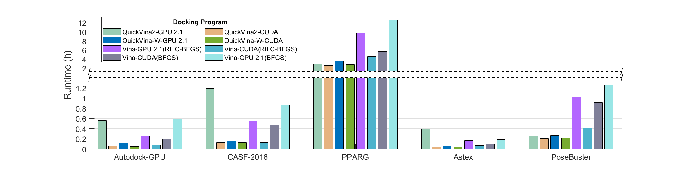

# Vina-CUDA
## Introduction
In this project, we propose **Vina-CUDA, QuickVina2-CUDA, and QuickVina-W-CUDA** based on [Vina-GPU 2.1, QuickVina2-GPU 2.1, and QuickVina-W-GPU 2.1](https://github.com/DeltaGroupNJUPT/Vina-GPU-2.1), which aims to further enhance Vina-GPU 2.1 and its variants docking speed by optimizing its core algorithms through deep utilization of GPU hardware features, thereby reducing the cost of virtual screening and increasing the efficiency of drug design. 

## The Acceleration and Accuracy of Vina-CUDA
* The runtime acceleration of Vina-CUDA, QuickVina2-CUDA, and QuickVina-W-CUDA comprae with the Vina-GPU 2.1, QuickVina 2-GPU 2.1 and QuickVina-W-GPU 2.1 in Autodock-GPU, CASF-2016, PPARG, Astex, and PoseBuster librarys.

* Accuracy comparison of Vina-CUDA, QuickVina2-CUDA, and QuickVina-W-CUDA on AutoDock-GPU dataset.

 ## Compiling and Running Methods
 ### Linux
 **Note**: At least 8M stack size is needed. To change the stack size, use `ulimit -s 8192`.
 #### 1.Common configuration
 1. install [boost library](https://www.boost.org/) (Current Version is 1.77.0)
 2. install [CUDA Toolkit](https://developer.nvidia.com/cuda-downloads) (Current Version: v12.2)   **Note**: CUDA library can be usually in `/usr/local/cuda` for NVIDIA GPU cards.
 3. install [GCC](https://gcc.gnu.org/)(Current Version is gcc (Ubuntu 9.4.0-1ubuntu1~20.04.2) 9.4.0)
 4. install [python3](https://www.python.org/downloads/) (for runing the Multi_GPU_docking.py)

 #### 2.Vina-CUDA，QuickVina2-CUDA, and QuickVina-W-CUDA Compilation and Running
 1. cd Vina-CUDA/QuickVina2-CUDA/QuickVina-W-CUDA folder, open the corresponding Makefile file and change the following information: 
       1. `$WORK_DIR` : Set as your working directory (eg: path/of/your/work/directory/Vina-CUDA);
       2. `$BOOST_LIB_PATH` : Set to the path where the BOOST library is located (eg: path/of/BOOST/boost_1_77_0);
       3. `$NVCC_COMPILER` : Set to the path of the NVCC compiler (eg: /usr/local/cuda-12.2/bin/nvcc).
       4. `$GRID_DIM`: Set to the size of kernel grid, eg.,-DGRID_DIM1=64, -DGRID_DIM2=128. (**Note**: `GRID_DIM1*GRID_DIM2` must be equal to the value of `thread` in the run command)
       5. `$DOCKING_BOX_SIZE`: Set to the `-DSAMLL_BOX` or `-DLARGE_BOX`. (**Note**: Please select the appropriate docking box according to the GPU memory size, otherwise an insufficient memory error may occur when the thread value is large.)
 2. Save the Makefile and type `make clean` and `make source -jthread` to build `$(VINA_CUDA_METHODS)`/`$(QuickVina2-CUDA_METHODS)`/`$(QuickVina-W-CUDA_METHODS)` that compile the kernel files on the fly (this would take some time at the first use).
 3. After a successful compiling (there may be some warnings about the BOOST library, which can usually be ignored without affecting the normal operation of the programme), you will see the `$(Vina-GPU-2-1-CUDA)`/ `$(QuickVina2-GPU-2-1-CUDA)`/`$(Vina-GPU-2-1-W-CUDA)` in the work directory.
 4. In the work directory,type `$(Vina-GPU-2-1-CUDA)`/ `$(QuickVina2-GPU-2-1-CUDA)`/`$(Vina-GPU-2-1-W-CUDA) --config ./input_file_example/1u1b_config.txt` to run the Vina-CUDA method. (**Note**: the default value of thread is 8192 for Vina-CUDA and QuickVina2-CUDA, QuickVina-W-CUDA is 6500)
 5. once you successfully run `$(VINA_CUDA_METHODS)`/`$(QuickVina2-CUDA_METHODS)`/`$(QuickVina-W-CUDA_METHODS)`, its runtime can be further reduced by typing `make clean` and `make` to build it without compiling kernel files.
 6. other compile options:

|Options| Description|
|--|--|
| -g | debug|
|-DTIME_ANALYSIS|output runtime analysis in `gpu_runtime.log`|
|-DDISPLAY_ADDITION_INFO|print addition information|
|-GRID_DIM|set the grid size (the value of `GRID_DIM1*GRID_DIM2`,eg. 64*128 must equal to the value of `thread`(eg. 8192) parameter)|
|-DSAMLL_BOX|the volume of the searching box less than 30/30/30 (will take less GPU memory)|
|-DLARGE_BOX|the volume of the searching box less than 70/70/70 (will take more GPU memory)

### Windows
The usage on the Windows platform can be referenced from the Vina-GPU 2.1 [documentation](https://github.com/DeltaGroupNJUPT/Vina-GPU-2.1?tab=readme-ov-file#windows) .

## Multi_GPU_docking
1. cd `Multi_GPU_Docking_Procedure` folder and open the `Multi_GPU_docking.py` file;
2. Configuring the absolute path of the docking program, the small molecule library path , the protein path , the GPU_ID value, and the thread value; (**Note**: Proteins and ligands are pdbqt files that have been processed in advance.)
3. Save the `Multi_GPU_docking.py` file and type ` python3 Multi_GPU_docking.py`. after runing, check the `output` folder.

## Usage
|Arguments| Description|Default value
|--|--|--|
|--config | the config file (in .txt format) that contains all the following arguments for the convenience of use| no default
| --receptor | the recrptor file (in .pdbqt format)| no default
|--ligand| the ligand file (in .pdbqt fotmat)| no default
|--ligand_directory| this path specifies the directory of all the input ligands(in .pdbqt format) | no default
|--output_directory| this path specifies the directory of the output ligands | no default
|--thread| the scale of parallelism (docking lanes)|8192
|--search_depth| the number of searching iterations in each docking lane| heuristically determined
|--center_x/y/z|the center of searching box in the receptor|no default
|--size_x/y/z|the volume of the searching box|no default 
|--rilc_bfgs| 1 is the rilc_bfgs optimization algorithm; 0 is the bfgs optimization algorithm | default is 1

## Limitation
1. Since the number of threads, the size of the docking box, and the ligand atom number are directly related to the GPU memory allocation in the program, their values should not exceed 10,000, 70×70×70, and 100, respectively.
2. Due to the variability of random seed values, the docking score error ranges from 0.1 to 0.5 in each run (this phenomenon also occurs in Vina-GPU 2.1).

## Changelog
- 2024-10-12: Release [Vina-CUDA v1.0].
- 2024-11-21: Upload source codes of Vina-CUDA (added source code for QuickVina-W-CUDA and QuickVina2-CUDA).
- 2025-01-10: Release [Vina-CUDA v1.1] (added optimized BFGS optimization algorithm).

## Citation
* Trott, Oleg, and Arthur J. Olson. "AutoDock Vina: improving the speed and accuracy of docking with a new scoring function, efficient optimization, and multithreading." Journal of computational chemistry 31.2 (2010): 455-461.
* Tang S, Ding J, Zhu X, et al. Vina-GPU 2.1: towards further optimizing docking speed and precision of AutoDock Vina and its derivatives[J]. IEEE/ACM Transactions on Computational Biology and Bioinformatics, 2024.
